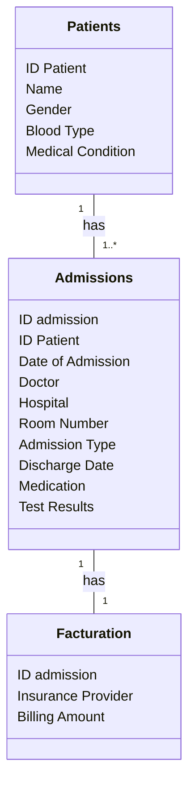

# Projet de Migration de Données Médicales vers MongoDB

## Description

Ce projet a pour objectif de migrer des données médicales depuis un fichier CSV vers une base de données MongoDB.
Le processus est automatisé à l'aide de scripts Python et utilise la conteneurisation via Docker pour garantir la portabilité et la scalabilité de l'application.

## Technologies Utilisées

- **Python** : Langage de programmation utilisé pour le script de migration.
- **Pandas** : Bibliothèque pour la manipulation et l'analyse des données.
- **Pymongo** : Bibliothèque pour interagir avec MongoDB.
- **MongoDB** : Base de données utilisée pour stocker les données médicales.
- **Docker** : Outil de conteneurisation pour déployer l'application.
- **dotenv** : Pour gérer les variables d'environnement.

## Rôles, utilisateurs et sécurité

Les noms et mots de passe sont à renseigner dans un fichier .env (voir chapitre Installation).

La création de la base de données est assurée par le root.

3 utilisateurs sont créés lors de la création de la base de données :
- L'administrateur (rôle "dbAdmin")
- un utilisateur actif (rôle "readWrite")
- un utilisateur consultant (rôle "read")
  
Une commande pour effacer les données de connexion doit être lancée à la fin de la migration (voir chapitre Utilisation).


## Installation

1. Clonez le dépôt :

   ```bash
   git clone https://github.com/IngridFi70/Projet_05.git
   cd Projet_05
   
2. Ajoutez vos variables d'environnement dans un fichier **.env** contenant :

   ```
   MONGO_INITDB_ROOT_USERNAME=  
   MONGO_INITDB_ROOT_PASSWORD=
   MONGO_INITDB_DATABASE=healthcare_db
   ADMIN_NAME=
   ADMIN_MDP=
   USER_RW_NAME=
   USER_RW_MDP=
   USER_R_NAME=
   USER_R_MDP=

## Utilisation

1. Assurez-vous que Docker est installé et en cours d'exécution.

2. Lancez les services Docker nécessaires (MongoDB et le script de migration) :

    ```bash
    docker-compose up

Le script de migration s'exécutera automatiquement lors du démarrage des conteneurs.

Vous pouvez vérifier les logs pour suivre le progrès de la migration.

3. Pour des raisons de sécurité, après exécution de toutes les étapes précédentes, lancez la commande suivante pour effacer les données sensibles :

    ```bash
    echo "MONGO_INITDB_ROOT_USERNAME=
    MONGO_INITDB_ROOT_PASSWORD=
    MONGO_INITDB_DATABASE=healthcare_db
    ADMIN_NAME=
    ADMIN_MDP=
    USER_RW_NAME=
    USER_RW_MDP=
    USER_R_NAME=
    USER_R_MDP=" > .env      


## Schéma des données




## Structure du Projet

- **main.py** : Script principal pour la migration des données.
- **requirements.txt** : Liste des dépendances nécessaires pour le projet.
- **docker-compose.yml** : Fichier de configuration pour les services Docker.
- **.env** : Fichier pour stocker les variables d'environnement.

## Contribuer
Les contributions sont les bienvenues ! Si vous souhaitez contribuer, merci de créer une issue.

## Licence
Ce projet n'est pas sous licence.

## Contact
Pour toute question concernant le projet, n'hésitez pas à me contacter via GitHub.
